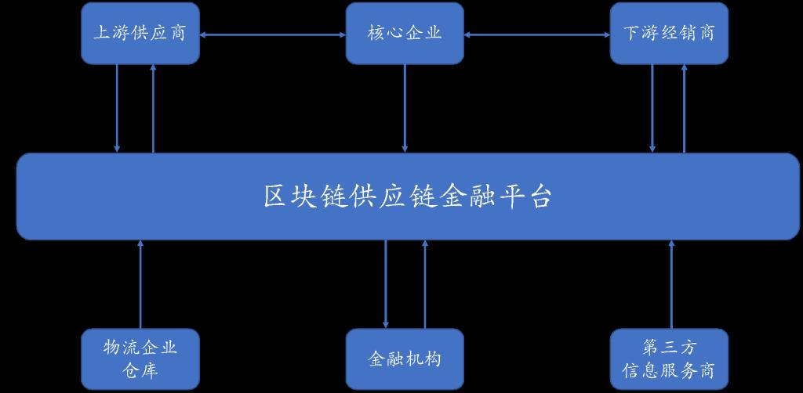
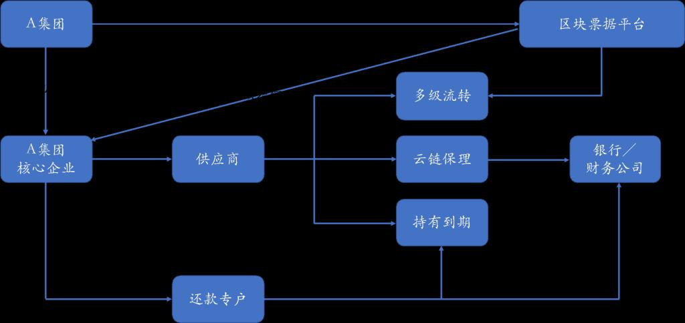
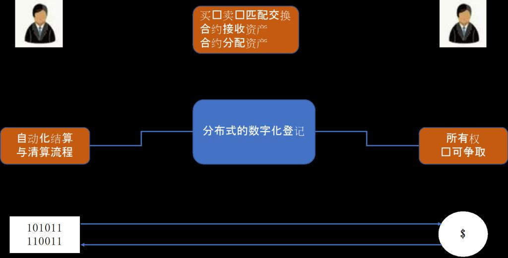

# 区块链+金融社区研究方向
供应链金融是以产业链为依托、以交易环节为重点、以资金调配为主线、以风险管理为保证，运用自偿性贸易融资的方式，将金融服务在整条供应链全面铺开，既致力于产业链交易的放大，也实现金融服务的普惠，达成参与企业的合作共赢。  
供应链金融是典型的多主体参与、信息不对称、信用机制不完善、信用标的非标准的场景，与区块链技术有天然的契合性。区块链技术可以打通多方协作，势必推动供应链金融市场的快速发展，而对底层资产的穿透式监管，也有助于提高资产评级，促进供应链金融产品的发行。
## 研究方向一：区块链供应链金融
区块链作为一种分布式账本，为各参与方提供了平等协作的平台，降低机构间信用协作风险和成本。链上信息的可追踪与不可篡改，多个机构之间数据实时同步，可实时对账。区块链平台的搭建，能够打通各层之间的交易关系，从而实现对与核心企业没有直接交易远端企业的信用传递，将其纳入供应链金融的服务范畴。

## 研究方向二：区块链数字票据
目前的票据市场面临几大问题：首先，假票、克隆票层出不穷，票据的真实性有难以确认；其次，票据到期后，承兑人未能及时地将资金划入持票人的账户；再次，票据的审验成本过高，催生了众多的票据掮客、中介，使得不透明、高杠杆错配、违规交易等现象经常发生。  
借助区块链实现的点对点交易能够打破票据中介的现有功能，实现票据价值传递的去中介化；基于区块链的信息不可篡改性，票据一旦交易完成，将不会存在赖账现象，从而避免“一票多卖”、打款背书不同步等行为，有效防范票据市场风险。基于区块链数据前后相连构成的时间戳，其完全透明的数据管理体系提供了可信任的追溯途径，可有效降低监管的审计成本。

## 研究方向三：区块链证券
区块链技术可以应用在证券行业的很多领域，包括证券发行、证券清算以及资产证券化等方面。在证券发行方面，一方面区块链技术可以将证券发行、分配、交易等行为电子化，提升发行效率。另一方面将减少信任成本。借助区块链可溯源、无法篡改的特点防止少数金融机构可能出现的操纵市场的行为。在证券清算与交收方面，区块链技术有可能减少中介环节、简化结算流程。在传统证券交易中，证券所有人发出的交易指令需要证券经纪人、资产托管人、中央银行和中央登记机构这四大机构依次进行处理，整个流程较为复杂，效率较低。如果通过智能合约直接实现买方与卖方的自动配对并且自动实现结算和清算，整个过程仅需10分钟，因此可提高清算结算的效率。
